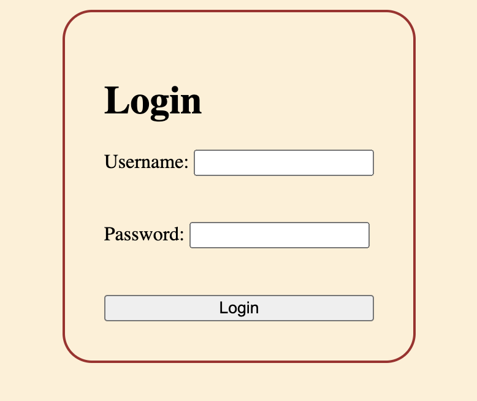

# First Login Form in Vanilla JavaScript 

Boca Code Week 4 Login Form: An interactive login form project combining HTML for the structure, Vanilla JavaScript for the functionality of a login form and CSS for styling. 

